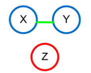
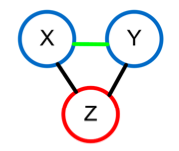
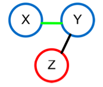

```{r setup, include=FALSE}
knitr::opts_chunk$set(echo = TRUE)
```


## Problems

### Problem 1

The problem for this week is to develop a little bit of content (tutorial material) that could be added to this lab. (6 points)


### The difference between partial and semi-partial correlation

The partial correlation coefficient is a measure that is used to describe the relationship between two random variables when BOTH of these variables are controlled (or partialled out) for the effects of a THIRD variable. In other words, the effect of the whole third variable is eliminated.

The semi-partial correlation describes the relationship between two variables when ONE of them is controlled for the effect of a THIRD variable. In other words, the effect of a fraction of a third variable is eliminated.

Let's take a look at three variables: X, Y, Z. For the purposes of our example, the relationship of interest is between X and Y (so let's call them variables of interest). To illustrate the difference between types of correlation, let's consider the following scenarios:

### Scenario 1

**None of the variables of interest are correlated with Z.**

```{r, out.width="40%", echo=FALSE}

```

For this situation, all three types of correlation  (correlation between all three variables, partial correlation and semi-partial correlation) have the identical value, since both X and Y have nothing to do with Z (@kim_compound_2012).

```{r}

# To create a Venn diagram in R you have to manually draw circles and fill them in

# Venn diagram with ggplot
library(tidyverse)
library(ggforce) #adds geom_circle

#Data frame to specify circle and text position
data <- data.frame(x=c(0,1,-1),
                   y=c(-2,1,1),
                   tx=c(0,1.5,-1.5),
                   ty=c(-3, 1.3, 1.3),
                   cat = c("Z","Y","X"))

# Plot circles and add annotations for overlapping segments

ggplot(data, aes(x0 = x, y0 = y, r =1.5, fill = cat)) +
  geom_circle(alpha=0.5, size=1, color="black", show.legend=FALSE) +
  geom_text(aes(x = tx, y = ty, label = cat), size=7) +
  annotate(geom="text", x=0, y=1, label="Lost Time", color="darkred", size=5) +
  annotate(geom="text", x=-0.9, y=0, label="Cute Cats",color="darkorange", size = 7) +
        annotate(geom="text", x=0.9, y=0, label="Internet",color="darkgreen", size = 7) +
        annotate(geom="text", x=0, y= -2.5, label="Excersise",color="blue", size = 7) +
        theme_void() 


# Set plot size

options(repr.plot.height=8, repr.plot.width=8)


```

So for this situation, "Lost Time" part of the Venn diagram will be both, partial and semi-partial correlation, as well as correlation of all three variables (see the table below).


### Scenario 2

**Both of the variables of interest are correlated with Z.**

```{r, out.width="40%", echo=FALSE}

```

   ......This is the situation, where ......
   
   
   
```{r}
data <- data.frame(x=c(0,1,-1),
                   y=c(-.5,1,1),
                   tx=c(0,1.7,-1.7),
                   ty=c(-1.5, 1.3, 1.3),
                   cat = c("Z","Y","X"))

ggplot(data, aes(x0 = x, y0 = y, r =1.5, fill = cat)) +
  geom_circle(alpha=0.5, size=1, color="black", show.legend=FALSE) +
  geom_text(aes(x = tx, y = ty, label = cat), size=7) +
  annotate(geom="text", x=1, y=0, label="Pasta", color="darkred", size=5) +
  annotate(geom="text", x=-1, y=0, label="Batter", color="darkred", size=5) +
  annotate(geom="text", x=0, y=1.5, label="Omelette", color="darkred", size=5) +
  annotate(geom="text", x=0, y=0.6, label="Pancakes", color="darkred", size=5) +
  annotate(geom="text", x=-1.7, y=1.7, label="Flour",color="darkorange", size = 7) +
        annotate(geom="text", x=1.7, y=1.7, label="Egg",color="darkgreen", size = 7) +
        annotate(geom="text", x=0, y= -1, label="Milk",color="blue", size = 7) +
        theme_void() 

options(repr.plot.height=8, repr.plot.width=8)


```


### Scenario 3

**Only one variable of interest (for example, Y) is correlated with Z.**

```{r, out.width="40%", echo=FALSE}

```

......In case of Figure 1c, the partial correlation is exactly same as the semipartial correlation, but is different from the correlation since Y is correlated with Z.....

```{r}
data <- data.frame(x= c( 2.1,1.3, -1),
                   y= c(-1,  1  ,  1),
                   tx=c( 2,  1.7, -1.7),
                   ty=c(-1.9,1.3, 1.3),
                   cat = c("Z","Y","X"))

ggplot(data, aes(x0 = x, y0 = y, r =1.5, fill = cat)) +
  geom_circle(alpha=0.5, size=1, color="black", show.legend=FALSE) +
  geom_text(aes(x = tx, y = ty, label = cat), size=7) +
  annotate(geom="text", x=1.8, y=0.1, label="Procrastisnacking", color="darkred", size=4) +
  annotate("segment", x=0.2, xend = 1.5, y=1, yend = 3, color="darkred", size=0.7) +
  annotate(geom="text", x=1.6, y=3.2, label="Powersnacking", color="darkred", size=4) +
  annotate(geom="text", x=-1.2, y=1.7, label="Studying for Stats",color="darkorange", size = 6) +
        annotate(geom="text", x=1.7, y=1.7, label="Snacking",color="darkgreen", size = 6) +
        annotate(geom="text", x=2, y= -1.5, label="Procrastinating",color="blue", size = 6) +
        theme_void()


options(repr.plot.height=8, repr.plot.width=8)


```


All three correlations are different from each other for the situation of Figure 1b. The rationale for the partial and semipartial correlations is to obtain a direct or pure relationship between two random variables. For example, in Figure 1b, although X and Y are uncorrelated to each other, the correlation can be a nonzero value due to Z. In this case, by removing the effect of Z, their direct or true relationship can be obtained. Likewise, the significant relationship between X and Y in Figure 1c can be due to the hidden relationship between X and Z. For these reasons, the partial or the semipartial correlations must be used to obtain the true relationship between X and Y if the relationship between (X, Y) and Z is present not due to measurement errors. However, it is possible that the partial or semipartial correlations can lead to an incorrect correlation if the correlation between (X, Y) and Z is spurious (caused by noise).


## References

https://youtu.be/saFyipc7Wd8


