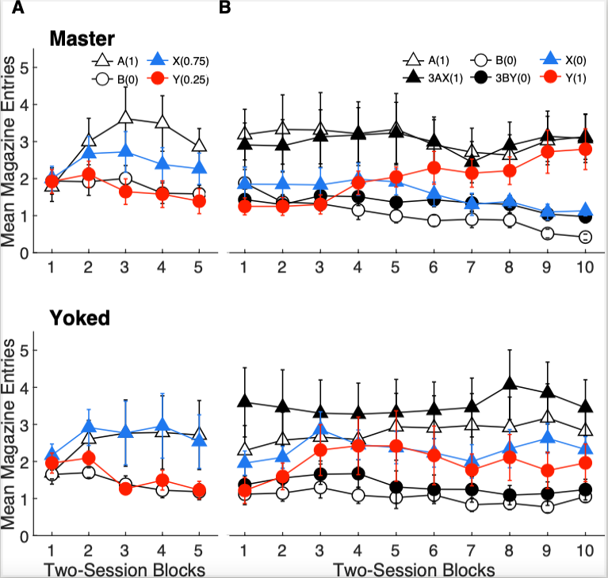

```{r setup, include=FALSE}
knitr::opts_chunk$set(echo = TRUE)
```


## Overview

There are multiple ways R can be used in science. It can build models and visualizations; it is used in deep learning and machine learning research, data mining, and of course, statistical computing and graphics. Scientists wildly use it for research reproduction.

For the final project, I've decided to apply the acquired knowledge to reproduce the plot generated by MatLab based on actual research data.

The original graph was created and saved in eps format. It looks like this:

```{r, echo=FALSE}

```

## Practical Section

First, let's load the data and the libraries that we will need.

```{r}

library(dplyr)
library(data.table)
library(ggplot2)
library(grid)

## Import data
Input_data <- fread("data/Input_data.csv")

```

### Filtering the data and calculating the means

To make the graphs, we first need to sort out the data and calculate the means for each point we need to graph.

The original plot has four graphs:

- top two graphs represent group 1 - "Master animals," with stage 1 of the experiment on the left-hand side and stage 2 on the right-hand side;
- two graphs on the bottom represent group 2 - "Yoked animals," with stages 1 and 2 on the left and right-hand side, respectively. 

Different colors and markers represent stimuli and compounds for better visualization:

- Stimuli A and B are white triangles and circles;
- Stimuli X and Y are blue triangles and red circles;
- Compounds AX and BY are black triangles and circles, respectively.

Let's try to reproduce one graph first. We will start with the top-left graph representing the data for Group 1 and Stage 1 of the experiment.

Here we have four stimuli (column "Epoch Role") that we are interested in - A, B, X and Y. However, the original data contains other information that we do not need, e.g., "preY-/Y+," so we need to filter it out.

The dependent variable (DV) is the Number of head entries to the magazine port during the last 5 seconds of the stimulus presentation ("Mean Magazine Entries" on the y-axis). Our DV is in the column named "NumberOfEntries," but we need to choose only the last 5 seconds. We need only to select lines with number 2 in the column called "SplitNo".

Group 1 is represented by all the "1" in the column "Group." Stage 1 is represented by all the "1" in the column "Stage."

The x-axis is represented by the column "2_seBlocks" because sessions are grouped in blocks of two. 

```{r}

## select the stimuli
cue <- c("A+", "B-", "Y-/Y+", "X+/X-")

## filter out the information we need and select the columns we need to build a plot
filtered_data <- Input_data %>% filter(SplitNo==2 & Stage==1 & Group==1 & EpochRole%in%cue) %>% select(Group,Rat,Stage,EpochRole,SplitNo,NumberOfEntries,`2_se Blocks`)

```

Now we can use this data to calculate the mean and the standard error of the mean (SEM):

```{r}
## calculate means and SEMs
means <- filtered_data  %>%
  group_by(`2_se Blocks`, EpochRole)%>%
  summarise(means = mean(NumberOfEntries),
            SEM = sd(NumberOfEntries)/sqrt(length(NumberOfEntries)))

```

And plot the results:

```{r}
## plot the data
ggplot(means, aes(x=`2_se Blocks`, y=means, group=EpochRole, color=EpochRole))+
  geom_point()+
  geom_line()+
  geom_errorbar(aes(ymin = means - SEM,
                    ymax = means + SEM),
                width = 0.25)

```


### Adjusting graph attributes

Now that we have the data graphed, we can make it look like the original graph.

I will first copy the code for calculating means because we need different filtering for each of the four graphs. 

```{r}

cue <- c("A+", "B-", "Y-/Y+", "X+/X-")

filtered_data <- Input_data %>% filter(SplitNo==2 & Stage==1 & Group==1 & EpochRole%in%cue) %>% select(Group,Rat,Stage,EpochRole,SplitNo,NumberOfEntries,`2_se Blocks`)

meansAA <- filtered_data  %>%
  group_by(`2_se Blocks`, EpochRole)%>%
  summarise(meansAA = mean(NumberOfEntries),
            stdevAA = sd(NumberOfEntries),
            SEM_AA = sd(NumberOfEntries)/sqrt(length(NumberOfEntries)))
```

Now we can adjust the aesthetics of the graph:

```{r}

AA <- ggplot(meansAA, aes(x=`2_se Blocks`, y=meansAA, group=EpochRole, color=EpochRole))+
  geom_point(aes(shape=EpochRole,color=EpochRole, size=2))+
  geom_line()+
  geom_errorbar(aes(ymin = meansAA - SEM_AA, ymax = meansAA + SEM_AA), width = 0.05)+
  theme_classic()+ #this will make the background white
  
  #adjust x and y axis
  ylim(0, 5)+
  xlim(0.8, 5)+
  
  scale_shape_manual(values=c(24, 21, 17, 16))+  #this line makes the shape of the markers
  
  #choose the colors for lines and markers 
  scale_fill_manual(values = c('white','white','blue','red')) + 
  scale_color_manual(values = c('black','black','blue','red')) + 
  
   ylab("Mean Magazine Entries")+
   theme(axis.title.x=element_blank(),
        axis.text.x=element_blank())+  # Remove x-axis title

  theme(legend.position = "none") +   # Remove legend
  theme(axis.text.y=element_text(size=10),
        axis.title=element_text(size=10),
        
        # make ticks on the x-axis facing inwards
        axis.ticks.length.x = unit(-.15, "cm"), 
        axis.text.x = element_text(margin = margin(t = 0.4, unit = "cm"), size=10))
  
AA

```


Now we can copy the code and adjust it to make the graph for Group 2, Stage 1 data.


```{r}

## Filter the data we need
cue <- c("A+", "B-", "Y-/Y+", "X+/X-")

filtered_data <- Input_data %>% filter(SplitNo==2 & Stage==1 & Group==2 & EpochRole%in%cue) %>% select(Group,Rat,Stage,EpochRole,SplitNo,NumberOfEntries,`2_se Blocks`)

## Calculate the means and SEMs

meansBB <- filtered_data  %>%
  group_by(`2_se Blocks`, EpochRole)%>%
  summarise(meansBB = mean(NumberOfEntries),
            SEM_BB = sd(NumberOfEntries)/sqrt(length(NumberOfEntries)))

## Plot

BB <- ggplot(meansBB, aes(x=`2_se Blocks`, y=meansBB, group=EpochRole, color=EpochRole))+
  geom_point(aes(shape=EpochRole,color=EpochRole, size=2))+
  geom_line()+
  geom_errorbar(aes(ymin = meansBB - SEM_BB, ymax = meansBB + SEM_BB), width = 0.05)+
  theme_classic()+
  ylim(0, 5)+
  xlim(0.8, 5)+
  scale_shape_manual(values=c(24, 21, 17, 16))+
  scale_fill_manual(values = c('white','white','blue','red')) + 
  scale_color_manual(values = c('black','black','blue','red')) +
  xlab("Two-Session Blocks") + 
  ylab("Mean Magazine Entries")+
  theme(legend.position = "none") + 
  theme(axis.text.y=element_text(size=10),
        axis.title=element_text(size=10),
        axis.ticks.length.x = unit(-.15, "cm"),
        axis.text.x = element_text(margin = margin(t = 0.4, unit = "cm"), size=10),
        legend.text=element_text(size=10),
        legend.title=element_text(size=10))

BB

```

And let's make the rest of graphs.

Group 1, Stage 2:

```{r}
## Filter the data we need

cue <- c("A+", "B-", "Y+", "X-", "AX+", "BY-")

filtered_data <- Input_data %>% filter(SplitNo==2 & Stage==2 & Group==1 & EpochRole%in%cue) %>% select(Group,Rat,Stage,EpochRole,SplitNo,NumberOfEntries,`2_se Blocks`)

## Calculate the means and SEMs

meansCC <- filtered_data  %>%
  group_by(`2_se Blocks`, EpochRole)%>%
  summarise(meansCC = mean(NumberOfEntries),
            SEM_CC = sd(NumberOfEntries)/sqrt(length(NumberOfEntries)))

## Plot

CC <- ggplot(meansCC, aes(x=`2_se Blocks`, y=meansCC, group=EpochRole, color=EpochRole))+
  geom_point(aes(shape=EpochRole,color=EpochRole, size=2))+
  geom_line()+
  geom_errorbar(aes(ymin = meansCC - SEM_CC, ymax = meansCC + SEM_CC), width = 0.05)+
  theme_classic()+
  ylim(0, 5)+
  scale_shape_manual(values=c(24, 17, 21, 16, 17, 16))+
  scale_fill_manual(values = c('white','black','black','black','blue','red')) + 
  scale_color_manual(values = c('black','black','black','black','blue','red')) +
  ylab("Mean Magazine Entries")+
  theme(axis.title.x=element_blank(),
        axis.text.x=element_blank())+

  scale_x_continuous(breaks=seq(0,10,1))+    ## adjust the numbers on x-axis

       
  theme(axis.text.y=element_blank(),
        axis.line.y=element_blank(),
        axis.title.y=element_blank(),
        axis.ticks.y=element_blank(),
        axis.title=element_text(size=10),
        axis.ticks.length.x = unit(-.15, "cm"),
        axis.text.x = element_text(margin = margin(t = 0.4, unit = "cm"), size=10),
        legend.text=element_text(size=10),
        legend.title = element_blank(),
        legend.position = "none")  
  
CC

```


Group 2, Stage 2:

```{r}

## Filter the data we need

cue <- c("A+", "B-", "Y+", "X-", "AX+", "BY-")

filtered_data <- Input_data %>% filter(SplitNo==2 & Stage==2 & Group==2 & EpochRole%in%cue) %>% select(Group,Rat,Stage,EpochRole,SplitNo,NumberOfEntries,`2_se Blocks`)


## Calculate the means and SEMs

means <- filtered_data  %>%
  group_by(`2_se Blocks`, EpochRole)%>%
  summarise(means = mean(NumberOfEntries),
            SEM = sd(NumberOfEntries)/sqrt(length(NumberOfEntries)))

## Plot

DD <- ggplot(means, aes(x=`2_se Blocks`, y=means, group=EpochRole, color=EpochRole))+
  geom_point(aes(shape=EpochRole,color=EpochRole, size=2))+
  geom_line()+
  geom_errorbar(aes(ymin = means - SEM, ymax = means + SEM), width = 0.05)+
  theme_classic()+
  ylim(0, 5)+
  scale_shape_manual(values=c(24, 17, 21, 16, 17, 16))+    #24, 21
  scale_fill_manual(values = c('white','black','black','black','blue','red')) + 
  scale_color_manual(values = c('black','black','black','black','blue','red')) +
  xlab("Two-Session Blocks") + 
  scale_x_continuous(breaks=seq(0,10,1))+
  theme(legend.position = "none") +   # Remove legend
  theme(axis.text.y=element_blank(),
        axis.line.y=element_blank(),
        axis.title.y=element_blank(),
        axis.ticks.y=element_blank(),
        axis.title.x=element_text(size=10),
        axis.ticks.length.x = unit(-.15, "cm"),
        axis.text.x = element_text(margin = margin(t = 0.4, unit = "cm"), size=10)) 
  
DD

```

### Combining graphs into one image

To put all four graphs on one image we can use the R package "Cowplot".

```{r}

library("cowplot")

plot_grid(AA, CC, BB, DD,  #choose the graphs
          labels = c("Master", NA, "Yoked", NA),  #make labels
          label_size = 12,
          hjust=-1.1, #adjust label position
          ncol = 2, nrow = 2, #put the graphs into two raws and two columns
          rel_widths = c(1, 2,1,2)) #adjust the width of graphs


## save the image in eps format

setEPS()
postscript("whatever.eps")
plot(rnorm(100), main="Hey Some Data")
dev.off()

ggsave(file="name.eps")

```

Et voilà!


## Practical Section

I left out a few things to work on for the practical section:

1. Add "A" and "B" titles to the plot to make it look exactly like the original. (3 points)
2. Make the ticks on the y-axis face inward. (3 points)
3. Create a legend that looks like the one on the original plot. (A hundred thousand bijillion points, because it's real hard)


